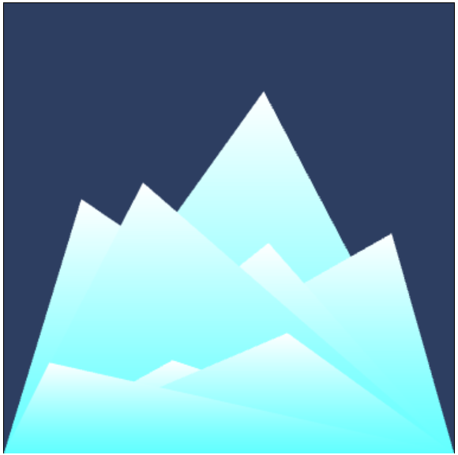

# Generative Art Gallery (with WebGL)

Welcome to the WebGL Generative Art Gallery! This project showcases beautiful generative art created using WebGL and JavaScript. Explore the interactive pieces and enjoy the unique visuals generated in real-time.

## Examples

Below are a couple of still images from this gallery - although the real ones are animated/interactive!

| 'Mountains'      | 'Triangle sea'               |
|------------------|------------------|
|  |  |

## Getting Started

To render the gallery visit:
https://rwells1703.github.io/generative-artwork-webgl/

Alternatively, to run these locally, clone the repository and open the `index.html` file in a web browser.